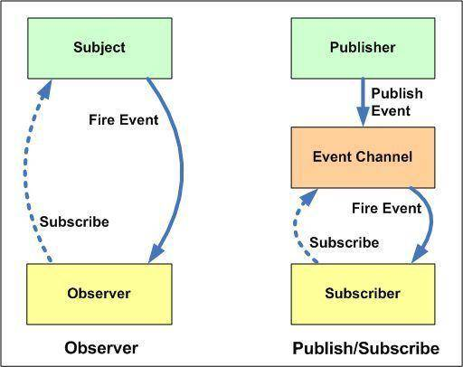
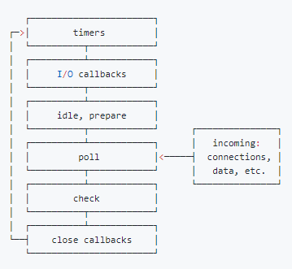

#### 1.用递归算法实现，数组长度为5且元素的随机数在2-32间不重复的值
```js
let array = new Array(5),
    num = random(),
    i = 0;
randomArr(array,num);
function randomArr(array,num){
    if(array.indexOf(num) < 0){
        array.push(num);
        i++;
    }else{
        num = random()
    }
    if(i >= array.length){
        console.log(array);
        return
    }else{
        randomArr(array,nm)
    }
}
function random(){
    return Math.floor(Math.random()*31+2)
}
```

#### 2.写一个方法去掉字符串中的空格
```js
let str = string.trim().split(' ').join('');

function trim(str){
    let reg = /\s+/g;
    let result = str.replace(reg,str);
    console.log(result);
}
```

#### 3.去除字符串中最后一个指定的字符
```js
function del(str,val){
    if(typeof str !== 'string'){
        console.log('不是字符串');
        return
    }
    let i = str.lastIndexOf(val);
    return str.substring(0,i) + str.substring(i+1,str.length)
}
```

#### 4.写一个方法把下划线命名转成大驼峰命名
```js
function trans(str){
    let temp = str.split('_');
    let arr =temp.map(item=>{
        return item.substr(0,1).toUpperCase() + item.substring(1);
    })
    console.log(arr.join(''))
}
```

#### 5.写一个把字符串大小写切换的方法
```js
function caseConvert(str){
    return str.replace(/([a-z]*)([A-Z]*)/g, (m, s1, s2)=>{
	return `${s1.toUpperCase()}${s2.toLowerCase()}`
    })
}
```

#### 6.写一个去除制表符和换行符的方法
```js
const removeSymbol = (str) => str.replace(/\t|\n|\r|\v|\f/g, "");

const str =
  "\t11122233\n_aaaaaaa\r\n_bbbbbb\t_3333333\r_4444444\n_555555";
  
console.log(removeSymbol(str));
```

#### 7.统计某一字符或字符串在另一个字符串中出现的次数
```js
function total(str,target){
    return (str.match(new RegExp(target, 'g')).length);
}
var childInNums = parent.split(child).length - 1
```

#### 8.写 React / Vue 项目时为什么要在列表组件中写 key，其作用是什么？
key的作用是为了在diff算法执行时更快的找到对应的节点，提高diff速度  

#### 9.['1', '2', '3'].map(parseInt) what & why ?
`[1,NaN,NaN]`  
`parseInt(string,radix)`函数用来解析字符串,使字符串成为指定基数的整数  
接受两个参数,第一个表示被处理的值,第二个表示解析时的基数(介于2~36之间)  
如果省略或为0,则以10为基础来解析,如果它以`0x``0X`开头,将以16为基数  
如果该参数小于 2 或者大于 36，则 parseInt() 将返回 NaN  

#### 10.什么是防抖和节流？有什么区别？如何实现？
1. 防抖  
n秒内函数只会执行一次,如果n秒内函数再次出触发,则重新计算时间  
```js
function debounce(fn){
    let timer = null
    return function(){
        cleartimeout(timer)
        timer = setTimeout(() => {
            fn.apply(this,arguments)
        },500)
    }
}
```
2. 节流  
高频事件触发,但在n秒内只会执行一次  
```js
function throttle(fn){
    let flag = true
    return function(){
        if(!flag) return
        flag = false
        setTimeout(() => {
            fn.apply(this,arguments)
            flag = true
        },500)
    }
}
```

#### 11.介绍下 Set、Map、WeakSet 和 WeakMap 的区别？
Set 和 Map主要的应用场景在于 `数据重组`和`数据存储`  
1. Set(集合)  
ES6新增的一种数据结构,类似于数组,但成员是唯一且无序的,没有重复的值  
Set本身是一种构造函数,用来生成Set数据结构 `new Set()`  
Set 对象允许你储存任何类型的唯一值,向 Set 加入值的时候，不会发生类型转换  
认为NaN等于自身  
- Set 实例属性   
    - constructor： 构造函数  
    - size：元素数量  
- Set 实例方法  
    - add(value)：新增，相当于 array里的push  
    - delete(value)：存在即删除集合中value  
    - has(value)：判断集合中是否存在 value  
    - clear()：清空集合  
`Array.from` 方法可以将 Set 结构转为数组  
2. WeakSet  
WeakSet对象允许你将弱引用对象存储在一个集合中  
WeakSet和Set的区别:  
- WeakSet 只能储存对象引用，不能存放值，而 Set 对象都可以  
- WeakSet 对象中储存的对象值都是被弱引用的，即垃圾回收机制不考虑 WeakSet 对该对象的应用，如果没有其他的变量或属性引用这个对象值，则这个对象将会被垃圾回收掉（不考虑该对象还存在于 WeakSet 中），所以，WeakSet 对象里有多少个成员元素，取决于垃圾回收机制有没有运行，运行前后成员个数可能不一致，遍历结束之后，有的成员可能取不到了（被垃圾回收了），WeakSet 对象是无法被遍历的（ES6 规定 WeakSet 不可遍历），也没有办法拿到它包含的所有元素  
- 属性：  
    - `constructor`：构造函数，任何一个具有 Iterable 接口的对象，都可以作参数  
- 方法:  
    `add(value)`：在WeakSet 对象中添加一个元素value  
    `has(value)`：判断 WeakSet 对象中是否包含value  
    `delete(value)`：删除元素 value  
    `clear()`：清空所有元素，*`注意该方法已废弃`*  
3. Map(字典)  
集合与字典的区别:  
- 共同点: 集合和字典可以存储不重复的值  
- 不同点: 集合是以`[value,value]`的形式存储元素,字典是以`[key,value]`的形式存储元素  
注意，只有对同一个对象的引用，Map 结构才将其视为同一个键  
- 属性：  
    - constructor：构造函数  
    - size：返回字典中所包含的元素个数  
- 操作方法：  
    - set(key, value)：向字典中添加新元素  
    - get(key)：通过键查找特定的数值并返回  
    - has(key)：判断字典中是否存在键key  
    - delete(key)：通过键 key 从字典中移除对应的数据  
    - clear()：将这个字典中的所有元素删除  
4. WeakMap  
WeakMap 对象是一组键值对的集合，其中的键是弱引用对象，而值可以是任意  
注意，WeakMap 弱引用的只是键名，而不是键值。键值依然是正常引用  
WeakMap 中，每个键对自己所引用对象的引用都是弱引用，在没有其他引用和该键引用同一对象，这个对象将会被垃圾回收（相应的key则变成无效的），所以，WeakMap 的 key 是不可枚举的  
- 属性：  
    - constructor：构造函数  
- 方法：  
    - has(key)：判断是否有 key 关联对象  
    - get(key)：返回key关联对象（没有则则返回 undefined）  
    - set(key)：设置一组key关联对象  
    - delete(key)：移除 key 的关联对象  
5. 总结  
Set  
成员唯一、无序且不重复  
[value, value]，键值与键名是一致的（或者说只有键值，没有键名）  
可以遍历，方法有：add、delete、has  
WeakSet  
成员都是对象  
成员都是弱引用，可以被垃圾回收机制回收，可以用来保存DOM节点，不容易造成内存泄漏  
不能遍历，方法有add、delete、has  
Map  
本质上是键值对的集合，类似集合  
可以遍历，方法很多可以跟各种数据格式转换  
WeakMap  
只接受对象作为键名（null除外），不接受其他类型的值作为键名  
键名是弱引用，键值可以是任意的，键名所指向的对象可以被垃圾回收，此时键名是无效的  
不能遍历，方法有get、set、has、delete  

#### 12.介绍下深度优先遍历和广度优先遍历，如何实现？

#### 13.请分别用深度优先思想和广度优先思想实现一个拷贝函数？

#### 14.ES5/ES6 的继承除了写法以外还有什么区别？
###### class
- `class`声明不像`function`声明,它不存在变量提升,它类似`let`声明,存在`TDZ`  
- `class`中的代码都会自动的使用严格模式,没办法选择  
- 所有的方法都是不可枚举的,注:非绑定当前对象的方法  
- `class`内所有的方法都缺少`[[Construct]]`方法,如果对这些方法进行`new`会出错  
- 不携带`new`操作符调用`class`会报错  
- 尝试在类的方法中改变类名会出错  

> `new.target`属性允许你检测函数或构造方法是否是通过new运算符被调用的  

继承的差异:  
```js
class Super {}
class Sub extends Super {}

const sub = new Sub();

Sub.__proto__ === Super;
```
子类可以直接通过 __proto__ 寻址到父类。  
```js
function Super() {}
function Sub() {}

Sub.prototype = new Super();
Sub.prototype.constructor = Sub;

var sub = new Sub();

Sub.__proto__ === Function.prototype;
```
而通过 ES5 的方式，`Sub.__proto__ === Function.prototype`  

#### 15.setTimeout、Promise、Async/Await 的区别
事件循环中分为宏任务队列和微任务队列  
`setTimeout`的回调函数放到宏任务队列里,等到执行栈清空后执行  
`promise`中`resolve`之前的同步代码会立即执行,回调函数会放到相应宏任务的微任务队列里,等宏任务中的同步代码执行完毕再执行  
`async`函数表示函数中可能会有异步方法,`await`后面跟一个表达式,`async`方法执行时,遇到`await`会立即执行表达式,然后把表达式后面的代码放到微任务队列里,让出执行栈,让同步代码先执行  

#### 16.Async/Await 如何通过同步的方式实现异步
`async awiat` 是一种语法糖，基于`Generator` 函数和自动执行器实现  

#### 17.异步笔试题
```js
//请写出下面代码的运行结果

async function async1() {
    console.log('async1 start');
    await async2();
    console.log('async1 end');
}
async function async2() {
    console.log('async2');
}
console.log('script start');
setTimeout(function() {
    console.log('setTimeout');
}, 0)
async1();
new Promise(function(resolve) {
    console.log('promise1');
    resolve();
}).then(function() {
    console.log('promise2');
});
console.log('script end');
```
`script start -> async1 start -> async2 -> promise1 -> script end -> async1 end -> promise2 -> setTimeout`

#### 18.算法手写题
已知如下数组：  

var arr = [ [1, 2, 2], [3, 4, 5, 5], [6, 7, 8, 9, [11, 12, [12, 13, [14] ] ] ], 10];  

编写一个程序将数组扁平化去并除其中重复部分数据，最终得到一个升序且不重复的数组  
```js
function flatten(arr){
	return Array.from(new Set(arr.flat(Infinity))).sort((a,b)=>a-b)
}
function flatten(arr) {
    let temp = [].concat(...arr.map(item => (Array.isArray(item) ? flatten(item) : [item])))
	return Array.from(new Set(temp)).sort((a, b) => {
		return a - b
	})
}
```

#### 19.JS 异步解决方案的发展历程以及优缺点。
1. 回调函数  
优点: 解决了同步问题  
缺点: 回调地狱,不能用try/catch捕获错误,不能return  
2. Promise  
优点: 解决了回调地狱,可以链式调用  
缺点: 无法取消promise,错误需要通过回调函数来捕获  
3. Generator  
优点: 可以控制函数的执行  
缺点: 写法较为繁琐  
4. Async/Await  
优点: 代码清晰,不用像Promise写很多then,处理了回调地狱问题  
缺点: await将异步代码改造成同步代码,如果多个异步操作没有依赖性而使用await会导致性能上的降低  

#### 20.Promise 构造函数是同步执行还是异步执行，那么 then 方法呢？
Promise构造函数是同步执行的,then方法中的回调函数是异步执行  

#### 21.情人节福利题，如何实现一个 new
```js
function _new(fn,...arg){
	const obj = Object.ceate(fn.prototype)
	const res = fn.call(obj,arg)
	return res instanceof Object ? res : obj
}
```

#### 22.简单讲解一下http2的多路复用
HTTP2采用二进制格式传输，取代了HTTP1.x的文本格式，二进制格式解析更高效  
多路复用代替了HTTP1.x的序列和阻塞机制，所有的相同域名请求都通过同一个TCP连接并发完成。在HTTP1.x中，并发多个请求需要多个TCP连接，浏览器为了控制资源会有6-8个TCP连接都限制  
HTTP2中:  
- 同域名下所有通信都在单个连接上完成，消除了因多个 TCP 连接而带来的延时和内存消耗  
- 单个连接上可以并行交错的请求和响应，之间互不干扰  

#### 23.谈谈你对TCP三次握手和四次挥手的理解

#### 24.A、B 机器正常连接后，B 机器突然重启，问 A 此时处于 TCP 什么状态
如果A 与 B 建立了正常连接后，从未相互发过数据，这个时候 B 突然机器重启，问 A 此时处于 TCP 什么状态？如何消除服务器程序中的这个状态？（超纲题，了解即可）  

#### 25.介绍下 npm 模块安装机制，为什么输入 npm install 就可以自动安装对应的模块？
1. npm模块安装机制  
	- 发出`npm install`命令  
	- 查询`node_modules`目录中是否已经存在指定模块  
		- 若存在,不再重新安装  
		- 不存在  
			- npm向registry(npm模块仓库提供的查询服务)查询模块压缩包的网址  
			- 下载压缩包,存放在根目录下的`.npm`目录里  
			- 解压压缩包到当前项目的`node_modules`目录  
2. npm实现原理  
	- 执行工程自称的`preinstall`  
	- 确定首层依赖模块  
		1. 首先需要做的是确定工程中的首层依赖,也就是dependencies和devDependences属性中直接指定的模块  
		2. 工程本身是整棵依赖树的根节点，每个首层依赖模块都是根节点下面的一棵子树，npm 会开启多进程从每个首层依赖模块开始逐步寻找更深层级的节点
	- 获取模块  
		1. 获取模块信息。在下载一个模块之前，首先要确定其版本，这是因为 package.json 中往往是 semantic version（semver，语义化版本）。此时如果版本描述文件（npm-shrinkwrap.json 或 			package-lock.json）中有该模块信息直接拿即可，如果没有则从仓库获取。如 packaeg.json 中某个包的版本是 ^1.1.0，npm 就会去仓库中获取符合 1.x.x 形式的最新版本  
		2. 获取模块实体。上一步会获取到模块的压缩包地址（resolved 字段），npm 会用此地址检查本地缓存，缓存中有就直接拿，如果没有则从仓库下载  
		3. 查找该模块依赖，如果有依赖则回到第1步，如果没有则停止  
	- 模块扁平化  
		上一步获取到的是一棵完整的依赖树，其中可能包含大量重复模块。在 npm3 以前会严格按照依赖树的结构进行安装，因此会造成模块冗余  
		从 npm3 开始默认加入了一个 dedupe 的过程。它会遍历所有节点，逐个将模块放在根节点下面，也就是 node-modules 的第一层。当发现有重复模块时，则将其丢弃  
	- 安装模块  
		这一步将会更新工程中的 node_modules，并执行模块中的生命周期函数（按照 preinstall、install、postinstall 的顺序）  
	- 执行工程自身生命周期  
		当前 npm 工程如果定义了钩子此时会被执行（按照 install、postinstall、prepublish、prepare 的顺序
	- 生成或更新版本描述文件  


#### 26.有以下 3 个判断数组的方法，请分别介绍它们之间的区别和优劣
- `Object.prototype.toString.call()`  
	每一个继承Object的对象都有`toString`方法,如果`toString`方法没有重写的话，会返回`[Object type]`,其中`type`为对象的类型。但当除了`Object`类型的对象外，其他类型直接使用`toString`方法时,会直接返回都是内容的字符串，所以我们需要使用call或者apply方法来改变toString方法的执行上下文  
- `instanceof`  
	内部机制是通过判断对象的原型链中是不是能找到类型的`prototype`  
	但`instanceof`只能用来判断对象类型，原始类型不可以,并且所有对象类型`instanceof Object`都是 true  
- `Array.isArray()`  
	ES5中提供的方法,判断对象是否为数组,本质上检测的是对象的`[[Class]]`值,`[[Class]]`是对象的一个内部属性,里面包含了对象的类型信息,格式为`[[objec Xxx]]`,Xxx就是对应的具体类型,对于数组而言,`[[Class]]`的值就是`[[object Array]]`
	老浏览器中可能需要polyfill
- `typeof`  
	只能判断基本数据类型,判断`null`结果为object,判断函数为`function`,其他引用类型都为object  

#### 27.介绍下重绘和回流（Repaint & Reflow），以及如何进行优化
***回流必将引起重绘,重绘不一定会引起回流***
1. 重绘:  
	当页面中元素样式的改变并不影响它在文档流中的位置时,浏览器会将新样式赋予元素并重新绘制它,这个过程称之为重绘  
2. 回流(重排):  
	当布局或者几何属性需要改变就称之为回流  
3. 浏览器优化  
	现代浏览器大多都是通过队列机制来批量更新布局,浏览器会将修改操作放入到队列里，直到过了一段时间或者操作达到了一个阈值，才清空队列。但是！当你获取布局信息的操作的时候，会强制队列刷新，比如当你访问以下属性或者使用以下方法:  
	- `offsetTop、offsetLeft、offsetWidth、offsetHeight`  
	- `scrollTop、scrollLeft、scrollWidth、scrollHeight`  
	- `clientTop、clientLeft、clientWidth、clientHeight`  
	- `getComputedStyle()` 
	- `getBoundingClientRect`  
	以上属性和方法都需要返回最新的布局信息，因此浏览器不得不清空队列，触发回流重绘来返回正确的值。因此，我们在修改样式的时候，**最好避免使用上面列出的属性，他们都会刷新渲染队列。**如果要使用它们，最好将值缓存起来  
4. 如何避免(优化):  
	css  
	- 使用`transform`替代`top`  
	- 使用`visibility`替换`display: none`  
	- 避免使用table布局,可能很小的一个小改动会造成整个 table 的重新布局  
	- 尽可能在DOM树的最末端改变class  
	- 避免设置多层内联样式  
	- 将动画效果应用到position属性为absolute或fixed的元素上,避免影响其他元素的布局，这样只是一个重绘，而不是回流，同时，控制动画速度可以选择 requestAnimationFrame  
	- 避免使用CSS表达式（例如：calc()）,可能会引发回流  
	js  
	- 避免频繁操作样式，最好一次性重写style属性，或者将样式列表定义为class并一次性更改class属性  
	- 避免频繁操作DOM，创建一个documentFragment，在它上面应用所有DOM操作，最后再把它添加到文档中  
	- 避免频繁读取会引发回流/重绘的属性，如果确实需要多次使用，就用一个变量缓存起来  
	- 对具有复杂动画的元素使用绝对定位，使它脱离文档流，否则会引起父元素及后续元素频繁回流  


#### 28.介绍下观察者模式和订阅-发布模式的区别，各自适用于什么场景
观察者模式中主体和观察者是互相感知的，发布-订阅模式是借助第三方来实现调度的，发布者和订阅者之间互不感知  


#### 29.聊聊 Redux 和 Vuex 的设计思想

#### 30.说说浏览器和 Node 事件循环的区别
1. Node Event Loop  
Node.js的运行机制如下:
- V8引擎解析JavaScript脚本。
- 解析后的代码，调用Node API。
- libuv库负责Node API的执行。它将不同的任务分配给不同的线程，形成一个Event Loop（事件循环），以异步的方式将任务的执行结果返回给V8引擎。
- V8引擎再将结果返回给用户。


node中事件循环顺序:  
外部数据输入-->轮询阶段(poll)-->检查阶段(check)-->关闭事件回调阶段(close callback)-->定时器检查阶段(timer)-->  
I/O事件回调阶段(I/O callbacks)-->闲置阶段(idle,prepare)-->轮询阶段-->按照此顺序反复进行  
- timers 阶段：这个阶段执行timer（setTimeout、setInterval）的回调,是由poll阶段控制的  
- I/O callbacks 阶段：处理一些上一轮循环中的少数未执行的 I/O 回调  
- idle, prepare 阶段：仅node内部使用  
- poll 阶段：获取新的I/O事件, 适当的条件下node将阻塞在这里  
	- 如果 poll 队列不为空，会遍历回调队列并同步执行，直到队列为空或者达到系统限制  
	- 如果 poll 队列为空时，会有两件事发生  
		- 如果有 setImmediate 回调需要执行，poll 阶段会停止并且进入到 check 阶段执行回调  
		- 如果没有 setImmediate 回调需要执行，会等待回调被加入到队列中并立即执行回调，这里同样会有个超时时间设置防止一直等待下去  
	- 当然设定了 timer 的话且 poll 队列为空，则会判断是否有 timer 超时，如果有的话会回到 timer 阶段执行回调。  
- check 阶段：执行 setImmediate() 的回调  
- close callbacks 阶段：一些准备关闭的回调函数,如执行 socket 的 close 事件回调  
注意：上面六个阶段都不包括 `process.nextTick()`  

`process.nextTick()`  
这个函数其实是独立于 Event Loop 之外的，它有一个自己的队列，当每个阶段完成后，如果存在 nextTick 队列，就会清空队列中的所有回调函数，并且优先于其他 microtask 执行  

Node与浏览器的 Event Loop 差异  
- node11版本一旦执行一个阶段里的一个宏任务(setTimeout,setInterval和setImmediate)就立刻执行微任务队列，这就跟浏览器端运行一致  
- node10及其之前版本：microtask会在事件循环的各个阶段之间执行，也就是一个阶段执行完毕，就会去执行microtask队列的任务  

#### 31.介绍模块化发展历程
可从IIFE、AMD、CMD、CommonJS、UMD、webpack(require.ensure)、ES Module、`<script type="module">` 这几个角度考虑。  
- IIFE: 使用自执行函数来编写模块化,特点:*在一个单独的函数作用域中执行代码,避免变量冲突*  
- AMD: 使用requireJS来编写模块化,特点:*依赖必须提前声明好*  
- CMD: 使用seaJS来编写模块化,特点L:*支持动态引入依赖文件*  
- CommonJS: nodejs中自带的模块化,通过require引入  
- UMD: 兼容AMD,CommonJS模块化语法  
- webpack(require.ensure): webpack2.x版本中的代码分割 
- ES Module: ES6中引入的模块化,通过export导出,import导入  

#### 32.全局作用域中，用 const 和 let 声明的变量不在 window 上，那到底在哪里？如何去获取？。
ES5中,顶层对象的属性和全局变量是等价的,var和function声明的全局变量,自然也是顶层对象  
ES6中,let,const,class声明的全局变量,不属于顶层对象的属性,它们会生成块级作用域,可以在作用域中获取到它们  

#### 33.cookie 和 token 都存放在 header 中，为什么不会劫持 token？
XSS: 跨站脚本攻击,通过各种方式将恶意代码注入到用户的页面中,通过脚本获取cookie或localStorage等信息,发起请求  
	 过滤<>标签,不信任用户输入,对用户身份信息等cookie层面的信息进行http-only处理  
CSRF: 跨站请求攻击,攻击者通过技术手段欺骗用户的浏览器访问一个曾经认证过的网站并进行操作,由于已经认证过,网站会认为是真正的用户在操作  
	  对于cookie不信任,对每次请求都进行身份认证,比如token的处理  
cookie和token都能被劫持,只是cookie会被浏览器自动带上,而token需要设置header才可以  

#### 34.两个数组合并成一个数组
请把两个数组 ['A1', 'A2', 'B1', 'B2', 'C1', 'C2', 'D1', 'D2'] 和 ['A', 'B', 'C', 'D']，合并为 ['A1', 'A2', 'A', 'B1', 'B2', 'B', 'C1', 'C2', 'C', 'D1', 'D2', 'D']。  
```js
let a = ['A1', 'A2', 'B1', 'B2', 'C1', 'C2', 'D1', 'D2']
let b = ['A', 'B', 'C', 'D'].map(item=>{
	return item + '3'
})
let c = [...a,...b].map(item=>{
	if(item.inclueds('3')){
		return item.split('')[0]
	}
	return item
})
```

#### 35.改造下面的代码，使之输出0 - 9，写出你能想到的所有解法。
```js
for (var i = 0; i< 10; i++){
	setTimeout(() => {
		console.log(i);
    }, 1000)
}
```
```js
for (let i = 0; i< 10; i++){
	setTimeout(() => {
		console.log(i);
    }, 1000)
}
for (var i = 0; i< 10; i++){
	(function(i){
		setTimeout(() => {
			console.log(i);
		}, 1000)
	})(i)
}
for (var i = 0; i< 10; i++){
	setTimeout((i) => {
		console.log(i);
    }, 1000,i)
}
```

#### 36.Virtual DOM 真的比操作原生 DOM 快吗？谈谈你的想法。

#### 37.下面的代码打印什么内容，为什么？
```js
var b = 10;
(function b(){
    b = 20;
    console.log(b); 
})();
```
***非匿名自执行函数,函数名只读无法修改***

#### 38.简单改造下面的代码，使之分别打印 10 和 20。
```js
var b = 10;
(function b(){
    b = 20;
    console.log(b); 
})();
```
```js
// 10
var b = 10;
(function b(b){
    console.log(b); 
    b = 20;
})(b);
// 20
(function (){
    b = 20;
    console.log(b); 
})();
```

#### 39.浏览器缓存读取规则
可以分成 Service Worker、Memory Cache、Disk Cache 和 Push Cache，那请求的时候 from memory cache 和 from disk cache 的依据是什么，哪些数据什么时候存放在 Memory Cache 和 Disk Cache中？  


#### 40.使用迭代的方式实现 flatten 函数。
```js
function flatten(arr){
    return arr.reduce((newVal,oldVal)=>{
        return newVal.concat(Array.isArray(oldVal)? flatten(oldVal) : oldVal)
    },[])
}
```

#### 41.下面代码中 a 在什么情况下会打印 1？
```js
// var a = ?;
if(a == 1 && a == 2 && a == 3){
 	console.log(1);
}
```
<!-- ==会进行隐式类型转换,会调用本类型的toString或者valueOf方法 -->
```js
var a = {
    i:1,
    toString(){
        return a.i++
    }
}
```

#### 42.介绍下 BFC 及其应用。
- Block Formatting Contexts(块级格式化上下文)  
它是页面中的一块渲染区域,并且有一套渲染规则,它决定了其子元素将如何定位,以及和其它元素的关系和相互作用  
- 特性  
1. BFC 内部的子元素，在垂直方向，边距会发生重叠。
2. BFC在页面中是独立的容器，外面的元素不会影响里面的元素，反之亦然。
3. BFC区域不与旁边的float box区域重叠。（可以用来清除浮动带来的影响）。
4. 计算BFC的高度时，浮动的子元素也参与计算。
- 如何生成BFC
1. 方法1：overflow: 不为visible，可以让属性是 hidden、auto。【最常用】
2. 方法2：浮动中：float的属性值不为none。意思是，只要设置了浮动，当前元素就创建了BFC。
3. 方法3：定位中：只要posiiton的值不是 static或者是relative即可，可以是absolute或fixed，也就生成了一个BFC。
4. 方法4：display为inline-block, table-cell, table-caption, flex, inline-flex
5. 根元素
- BFC应用
1. 阻止margin重叠
2. 可以包含浮动元素 —— 清除内部浮动(清除浮动的原理是两个div都位于同一个 BFC 区域之中)
3. 自适应两栏布局
4. 可以阻止元素被浮动元素覆盖

#### 43.下面代码输出什么
```js
var a = 10;
(function () {
    console.log(a)   //undefined
    a = 5
    console.log(window.a)  //10
    var a = 20;
    console.log(a)  //20
})()
```

#### 44.实现一个 sleep 函数
比如 sleep(1000) 意味着等待1000毫秒，可从 Promise、Generator、Async/Await 等角度实现  
```js
function sleep(time){
    return new Promise((resolve,reject)=>{
        setTimeout(resolve,time)
    })
}
sleep(1000).then(()=>{
    console.log(123)
})

const sleep = (time) => {
    return new Promise((resolve => setTimeout(resolve,time)))
}
async function sleepAsync(){
    await sleep(1000)
    console.log(123)
}
sleepAsync()

function* sleepGenerator(time){
    yield new Promise(resolve => setTimeout(resolve,time))
}
sleepGenerator(1000).next().value.then(()=>{
    console.log(123)
})

function sleep(fn,time){
    if(typeof fn === 'function'){
        setTimeout(fn,time)
    }
}
function fns(){
    console.log(123)
}
sleep(fns,1000)
```

#### 45.使用 sort() 对数组 [3, 15, 8, 29, 102, 22] 进行排序，输出结果
102 15 22 29 3 8
Array.sort()默认的排序方法会将数组元素转换为字符串,然后比较字符串中字符的UTF-16编码顺序来进行排序  

#### 46.介绍 HTTPS 握手过程

#### 47.HTTPS 握手过程中，客户端如何验证证书的合法性
- 校验证书的颁发机构是否受客户端信任。  
- 通过 CRL 或 OCSP 的方式校验证书是否被吊销。  
- 对比系统时间，校验证书是否在有效期内。  
- 通过校验对方是否存在证书的私钥，判断证书的网站域名是否与证书颁发的域名一致。  

#### 48.输出以下代码执行的结果并解释为什么
```js
var obj = {
    '2': 3,
    '3': 4,
    'length': 2,
    'splice': Array.prototype.splice,
    'push': Array.prototype.push
}
obj.push(1)
obj.push(2)
console.log(obj)
```
```js
// 类数组
[,,1,3,splice:Array.prototype.splice,push:Array.prototype.push]
```
`push`方法根据length属性来决定从哪里开始插入给定的值,如果length不能转成数值,则插入的元素索引为0,包括不存在时,则创建它  
浏览器控制台中 DevTools会判断是否为类数组
类数组必须有几个组成部分:  
1. 属性要为索引(数字)属性  
2. 必须有length属性  
3. 最好加上push方法  
4. `splice` Array.prototype.splice  

#### 49.call 和 apply 的区别是什么，哪个性能更好一些
传参方式不一样,call和apply第一个参数都是指定this指向,call从第二个参数开始参数是一个个传递,而apply是传入带下标的集合,数组或类数组  
call比apply的性能好,因为call传入的参数格式正是内部所需要的格式  

#### 50.为什么通常在发送数据埋点请求的时候使用的是 1x1 像素的透明 gif 图片？

#### 51.实现 (5).add(3).minus(2) 功能。
例： 5 + 3 - 2，结果为 6  
```js
Number.prototype.add = (n)=>{
    return this.valueOf() + n
}
Number.prototype.minus = (n)=>{
    return this.valueOf() - n
}
```

#### 52.怎么让一个 div 水平垂直居中

#### 53.输出以下代码的执行结果并解释为什么
```js
var a = {n: 1};
var b = a;
a.x = a = {n: 2};

console.log(a.x) 	//undefined
console.log(b.x)    //{n:2}
```
`.`运算符优先级高于`=`运算符

#### 54.冒泡排序如何实现，时间复杂度是多少， 还可以如何改进？

#### 55.某公司 1 到 12 月份的销售额存在一个对象里面
如下：{1:222, 2:123, 5:888}，请把数据处理为如下结构：[222, 123, null, null, 888, null, null, null, null, null, null, null]。  
```js
let obj = {1:222, 2:123, 5:888}
const result = Array.from({length:12}).map((item,index)=>{
    return obj[index+1] || null
})
```

#### 56.要求设计 LazyMan 类，实现以下功能。
```js
LazyMan('Tony');
// Hi I am Tony

LazyMan('Tony').sleep(10).eat('lunch');
// Hi I am Tony
// 等待了10秒...
// I am eating lunch

LazyMan('Tony').eat('lunch').sleep(10).eat('dinner');
// Hi I am Tony
// I am eating lunch
// 等待了10秒...
// I am eating diner

LazyMan('Tony').eat('lunch').eat('dinner').sleepFirst(5).sleep(10).eat('junk food');
// Hi I am Tony
// 等待了5秒...
// I am eating lunch
// I am eating dinner
// 等待了10秒...
// I am eating junk food
```
```js

```

#### 57.分析比较 opacity: 0、visibility: hidden、display: none 优劣和适用场景。
`display:none`不占空间,不能点击,造成文档回流,性能消耗较大  
`visibility:hidden`占据空间,不能点击,只会造成本元素的重绘,性能消耗较少  
`opacity:0`占据空间,能点击,会造成重绘，性能消耗较少  
若父节点元素应用了opacity:0和display:none，无论其子孙元素如何挣扎都不会再出现在大众视野  
父节点元素应用visibility:hidden，子孙元素应用visibility:visible，那么其就会毫无意外的显现出来  

#### 58.箭头函数与普通函数（function）的区别是什么？构造函数（function）可以使用 new 生成实例，那么箭头函数可以吗？为什么？
- 箭头函数没有 this，它会从自己的作用域链的上一层继承 this（因此无法使用 apply / call / bind 进行绑定 this 值）；
- 不绑定 arguments，当在箭头函数中调用 aruguments 时同样会向作用域链中查询结果；
- 不绑定 super 和 new.target；
- 没有 prototype 属性，即指向 undefined；
- 无法使用 new 实例化对象，因为普通构造函数通过 new 实例化对象时 this 指向实例对象，而箭头函数没有 this 值，同时 箭头函数也没有 prototype。

#### 59.给定两个数组，写一个方法来计算它们的交集。
例如：给定 nums1 = [1, 2, 2, 1]，nums2 = [2, 2]，返回 [2, 2]。  

#### 60.已知如下代码，如何修改才能让图片宽度为 300px ？注意下面代码不可修改。
```html

```
`max-width:300px;`覆盖其样式；
`transform: scale(0.625);`按比例缩放图片
`box-sizing: border-box;padding: 0 90px;`
`document.getElementsByTagName("img")[0].setAttribute("style","width:300px!important;")`

#### 61.介绍下如何实现 token 加密
- jwt  
- 需要一个secret（随机数）  
- 后端利用secret和加密算法(如：HMAC-SHA256)对payload(如账号密码)生成一个字符串(token)，返回前端  
- 前端每次request在header中带上token  
- 后端用同样的算法解密  

#### 62.如何设计实现无缝轮播
因为轮播图基本都在ul盒子里面的li元素,  
首先获取第一个li元素和最后一个li元素,  
克隆第一个li元素,和最后一个li元素,  
分别插入到lastli的后面和firstli的前面,  
然后监听滚动事件,如果滑动距离超过x或-x,让其实现跳转下一张图或者跳转上一张,(此处最好设置滑动距离),  
然后在滑动最后一张实现最后一张和克隆第一张的无缝转换,当到克隆的第一张的时候停下的时候,,让其切入真的第一张,则实现无线滑动,向前滑动同理  

#### 63.模拟实现一个 Promise.finally
```js
Promise.prototype.finally = function (callback) {
  let P = this.constructor;
  return this.then(
    value  => P.resolve(callback()).then(() => value),
    reason => P.resolve(callback()).then(() => { throw reason })
  );
};
```

#### 64. a.b.c.d 和 a['b']['c']['d']，哪个性能更高？

#### 65.ES6 代码转成 ES5 代码的实现思路是什么
将ES6的代码转换为AST语法树，然后再将ES6 AST转为ES5 AST，再将AST转为代码  

#### 66.数组编程题
随机生成一个长度为 10 的整数类型的数组，例如 [2, 10, 3, 4, 5, 11, 10, 11, 20]，将其排列成一个新数组，要求新数组形式如下，例如 [[2, 3, 4, 5], [10, 11], [20]]。  
```js

```

#### 67.如何解决移动端 Retina 屏 1px 像素问题

#### 68.如何把一个字符串的大小写取反（大写变小写小写变大写），例如 ’AbC' 变成 'aBc' 。
```js
function processString (s) {
    var arr = s.split('');
    var new_arr = arr.map((item) => {
        return item === item.toUpperCase() ? item.toLowerCase() : item.toUpperCase();
    });
    return new_arr.join('');
}
console.log(processString('AbC'));
```

#### 69.介绍下 webpack 热更新原理，是如何做到在不刷新浏览器的前提下更新页面的
https://zhuanlan.zhihu.com/p/30669007  

#### 70.实现一个字符串匹配算法，从长度为 n 的字符串 S 中，查找是否存在字符串 T，T 的长度是 m，若存在返回所在位置。
```js
const find = (S, T) => {
  if (S.length < T.length) return -1
  for (let i = 0; i < S.length; i++) {
    if (S.slice(i, i + T.length) === T) return i
  }
  return -1
}
```

#### 71.为什么普通 for 循环的性能远远高于 forEach 的性能，请解释其中的原因。

#### 72.介绍下 BFC、IFC、GFC 和 FFC

#### 73.使用 JavaScript Proxy 实现简单的数据绑定

#### 74.数组里面有10万个数据，取第一个元素和第10万个元素的时间相差多少
js 中数组元素的存储方式并不是连续的，而是哈希映射关系。哈希映射关系，可以通过键名 key，直接计算出值存储的位置，所以查找起来很快  

#### 75.输出以下代码运行结果
```js
// example 1
var a={}, b='123', c=123;  
a[b]='b';
a[c]='c';  
console.log(a[b]);
// 'c'
---------------------
// example 2
var a={}, b=Symbol('123'), c=Symbol('123');  
a[b]='b';
a[c]='c';  
console.log(a[b]);
// 'b'
---------------------
// example 3
var a={}, b={key:'123'}, c={key:'456'};  
a[b]='b';
a[c]='c';  
console.log(a[b]);
// 'c'
// 对象类型会调用 toString 方法转换成字符串 [object Object]
```

#### 76.算法题「旋转数组」
给定一个数组，将数组中的元素向右移动 k 个位置，其中 k 是非负数。  

示例 1：  

输入: [1, 2, 3, 4, 5, 6, 7] 和 k = 3  
输出: [5, 6, 7, 1, 2, 3, 4]  
解释:  
向右旋转 1 步: [7, 1, 2, 3, 4, 5, 6]  
向右旋转 2 步: [6, 7, 1, 2, 3, 4, 5]  
向右旋转 3 步: [5, 6, 7, 1, 2, 3, 4]  
示例 2：  

输入: [-1, -100, 3, 99] 和 k = 2  
输出: [3, 99, -1, -100]  
解释:   
向右旋转 1 步: [99, -1, -100, 3]  
向右旋转 2 步: [3, 99, -1, -100]  

#### 77.input 搜索如何防抖，如何处理中文输入
通过compositionstart & compositionend做的中文输入处理  

#### 78.介绍下 Promise.all 使用、原理实现及错误处理

#### 79.打印出 1 - 10000 之间的所有对称数
例如：121、1331 等  
```js
let result = [];
for (let i = 1; i <= 10000; i++) {
    let reverse = Number(i.toString().split('').reverse().join(''));
    if (i === reverse) {
        result.push(i);
    }
}
```

#### 80.周一算法题之「移动零」
给定一个数组 nums，编写一个函数将所有 0 移动到数组的末尾，同时保持非零元素的相对顺序。  

示例:  
输入: [0,1,0,3,12]  
输出: [1,3,12,0,0]  
说明:  

必须在原数组上操作，不能拷贝额外的数组。  
尽量减少操作次数。  

#### 81.var、let 和 const 区别的实现原理是什么
var可以重复声明,无法限制修改,没有块级作用域  
let不能重复声明,变量可以修改  
const定义一个不能修改的常量,不能重复声明  
与var不同的是,let和const是直接在最近的词法环境中定义变量  
var的话会直接在栈内存里预分配内存空间，然后等到实际语句执行的时候，再存储对应的变量，如果传的是引用类型，那么会在堆内存里开辟一个内存空间存储实际内容，栈内存会存储一个指向堆内存的指针  
let的话，是不会在栈内存里预分配内存空间，而且在栈内存分配变量时，做一个检查，如果已经有相同变量名存在就会报错  
const的话，也不会预分配内存空间，在栈内存分配变量时也会做同样的检查。不过const存储的变量是不可修改的，对于基本类型来说你无法修改定义的值，对于引用类型来说你无法修改栈内存里分配的指针，但是你可以修改指针指向的对象里面的属性  

#### 82.请实现一个 add 函数，满足以下功能。
```js
add(1); 			// 1
add(1)(2);  	// 3
add(1)(2)(3)；// 6
add(1)(2, 3); // 6
add(1, 2)(3); // 6
add(1, 2, 3); // 6
```

#### 83.算法题之「两数之和」
给定一个整数数组和一个目标值，找出数组中和为目标值的两个数。  
你可以假设每个输入只对应一种答案，且同样的元素不能被重复利用。  

示例：  
给定 nums = [2, 7, 11, 15], target = 9  
因为 nums[0] + nums[1] = 2 + 7 = 9  
所以返回 [0, 1]  

#### 84.在输入框中如何判断输入的是一个正确的网址。

#### 85.实现 convert 方法，把原始 list 转换成树形结构，要求尽可能降低时间复杂度
```js
//以下数据结构中，id 代表部门编号，name 是部门名称，parentId 是父部门编号，为 0 代表一级部门，现在要求实现一个 convert 方法，把原始 list 转换成树形结构，parentId 为多少就挂载在该 id 的属性 children 数组下，结构如下：

// 原始 list 如下
let list =[
    {id:1,name:'部门A',parentId:0},
    {id:2,name:'部门B',parentId:0},
    {id:3,name:'部门C',parentId:1},
    {id:4,name:'部门D',parentId:1},
    {id:5,name:'部门E',parentId:2},
    {id:6,name:'部门F',parentId:3},
    {id:7,name:'部门G',parentId:2},
    {id:8,name:'部门H',parentId:4}
];
const result = convert(list, ...);

// 转换后的结果如下
let result = [
    {
      id: 1,
      name: '部门A',
      parentId: 0,
      children: [
        {
          id: 3,
          name: '部门C',
          parentId: 1,
          children: [
            {
              id: 6,
              name: '部门F',
              parentId: 3
            }, {
              id: 16,
              name: '部门L',
              parentId: 3
            }
          ]
        },
        {
          id: 4,
          name: '部门D',
          parentId: 1,
          children: [
            {
              id: 8,
              name: '部门H',
              parentId: 4
            }
          ]
        }
      ]
    },
  ···
];
```

#### 86.设计并实现 Promise.race()

#### 87.实现模糊搜索结果的关键词高亮显示

#### 88.介绍下 HTTPS 中间人攻击

#### 89.已知数据格式，实现一个函数 fn 找出链条中所有的父级 id
```js
const value = '112'
const fn = (value) => {
...
}
fn(value) // 输出 [1， 11， 112]
```


#### 90.给定两个大小为 m 和 n 的有序数组 nums1 和 nums2。请找出这两个有序数组的中位数。要求算法的时间复杂度为 O(log(m+n))。
```js
//示例 1：
nums1 = [1, 3]
nums2 = [2]
//中位数是 2.0
//示例 2：
nums1 = [1, 2]
nums2 = [3, 4]
//中位数是(2 + 3) / 2 = 2.5
```


#### 91.模拟实现一个深拷贝，并考虑对象相互引用以及 Symbol 拷贝的情况

#### 92.介绍下前端加密的常见场景和方法

#### 93.写出如下代码的打印结果
```js
function changeObjProperty(o) {
  o.siteUrl = "http://www.baidu.com"
  o = new Object()
  o.siteUrl = "http://www.google.com"
} 
let webSite = new Object();
changeObjProperty(webSite);
console.log(webSite.siteUrl);
```

#### 94.编程算法题
用 JavaScript 写一个函数，输入 int 型，返回整数逆序后的字符串。如：输入整型 1234，返回字符串“4321”。要求必须使用递归函数调用，不能用全局变量，输入函数必须只有一个参数传入，必须返回字符串。  

#### 95.请写出如下代码的打印结果
```js
function Foo() {
Foo.a = function() {
  console.log(1)
}
this.a = function() {
  console.log(2)
}
}
Foo.prototype.a = function() {
console.log(3)
}
Foo.a = function() {
console.log(4)
}
Foo.a();
let obj = new Foo();
obj.a();
Foo.a();
```

#### 96.修改以下 print 函数，使之输出 0 到 99，或者 99 到 0
```js
//要求：
//1、只能修改 setTimeout 到 Math.floor(Math.random() * 1000 的代码
//2、不能修改 Math.floor(Math.random() * 1000
//3、不能使用全局变量
function print(n){
setTimeout(() => {
 console.log(n);
}, Math.floor(Math.random() * 1000));
}
for(var i = 0; i < 100; i++){
print(i);
}
```

#### 97.不用加减乘除运算符，求整数的7倍

#### 98.模拟实现一个 localStorage

#### 99.模拟 localStorage 时如何实现过期时间功能

#### 100.编程题
url有三种情况  

https://www.xx.cn/api?keyword=&level1=&local_batch_id=&elective=&local_province_id=33  
https://www.xx.cn/api?keyword=&level1=&local_batch_id=&elective=800&local_province_id=33  
https://www.xx.cn/api?keyword=&level1=&local_batch_id=&elective=800,700&local_province_id=33  
匹配elective后的数字输出（写出你认为的最优解法）:  

[] || ['800'] || ['800','700']  

#### 101.分别写出如下代码的返回值
```js
String('11') == new String('11');
String('11') === new String('11');
```

#### 102.考虑到性能问题，如何快速从一个巨大的数组中随机获取部分元素。
比如有个数组有100K个元素，从中不重复随机选取10K个元素。  

#### 103.请写出如下代码的打印结果
```js
var name = 'Tom';
(function() {
 if (typeof name == 'undefined') {
     var name = 'Jack';
     console.log('Goodbye ' + name);
 } else {
     console.log('Hello ' + name);
 }
})();
```

#### 104.扩展题，请写出如下代码的打印结果
```js
var name = 'Tom';
(function() {
 if (typeof name == 'undefined') {
     name = 'Jack';
     console.log('Goodbye ' + name);
 } else {
     console.log('Hello ' + name);
 }
})();
```

#### 105.编程题，请写一个函数，完成以下功能
输入 '1, 2, 3, 5, 7, 8, 10' 输出 '1~3, 5, 7~8, 10'  

#### 106.编程题，写个程序把 entry 转换成如下对象
```js
var entry = {
a: {
b: {
  c: {
    dd: 'abcdd'
  }
},
d: {
  xx: 'adxx'
},
e: 'ae'
}
}

// 要求转换成如下对象
var output = {
'a.b.c.dd': 'abcdd',
'a.d.xx': 'adxx',
'a.e': 'ae'
}
```

#### 107.编程题，写个程序把 entry 转换成如下对象（跟昨日题目相反）
```js
var entry = {
'a.b.c.dd': 'abcdd',
'a.d.xx': 'adxx',
'a.e': 'ae'
}

// 要求转换成如下对象
var output = {
a: {
b: {
  c: {
    dd: 'abcdd'
  }
},
d: {
  xx: 'adxx'
},
e: 'ae'
}
}
```

#### 108.编程题，根据以下要求，写一个数组去重函数（蘑菇街）
如传入的数组元素为[123, "meili", "123", "mogu", 123]，则输出：[123, "meili", "123", "mogu"]  
如传入的数组元素为[123, [1, 2, 3], [1, "2", 3], [1, 2, 3], "meili"]，则输出：[123, [1, 2, 3], [1, "2", 3], "meili"]  
如传入的数组元素为[123, {a: 1}, {a: {b: 1}}, {a: "1"}, {a: {b: 1}}, "meili"]，则输出：[123, {a: 1}, {a: {b: 1}}, {a: "1"}, "meili"]  

#### 109.编程题，找出字符串中连续出现最多的字符和个数（蘑菇街）
```js
'abcaakjbb' => {'a':2,'b':2}
'abbkejsbcccwqaa' => {'c':3}
```

#### 110.写一个单向链数据结构的 js 实现并标注复杂度（水滴筹）

#### 111.输出以下代码运行结果
```js
1 + "1"

2 * "2"

[1, 2] + [2, 1]

"a" + + "b"
```

#### 112.介绍下 http1.0、1.1、2.0 协议的区别？

#### 113.为什么 for 循环嵌套顺序会影响性能？
```js
var t1 = new Date().getTime()
for (let i = 0; i < 100; i++) {
  for (let j = 0; j < 1000; j++) {
    for (let k = 0; k < 10000; k++) {
    }
  }
}
var t2 = new Date().getTime()
console.log('first time', t2 - t1)

for (let i = 0; i < 10000; i++) {
  for (let j = 0; j < 1000; j++) {
    for (let k = 0; k < 100; k++) {

    }
  }
}
var t3 = new Date().getTime()
console.log('two time', t3 - t2)
```

#### 114.统计 1 ~ n 整数中出现 1 的次数。

#### 115.webpack 打包 vue 速度太慢怎么办？

#### 116.永久性重定向（301）和临时性重定向（302）对 SEO 有什么影响

#### 117.算法题
如何将[{id: 1}, {id: 2, pId: 1}, ...] 的重复数组（有重复数据）转成树形结构的数组 [{id: 1, child: [{id: 2, pId: 1}]}, ...] （需要去重）  

#### 118.扑克牌问题
有一堆扑克牌，将牌堆第一张放到桌子上，再将接下来的牌堆的第一张放到牌底，如此往复；  
最后桌子上的牌顺序为： (牌底) 1,2,3,4,5,6,7,8,9,10,11,12,13 (牌顶)；  
问：原来那堆牌的顺序，用函数实现。  

#### 119.如何用 css 或 js 实现多行文本溢出省略效果，考虑兼容性

#### 120.Http 状态码 301 和 302 的应用场景分别是什么

#### 121.输出以下代码执行结果
```js
function wait() {
return new Promise(resolve =>
 setTimeout(resolve, 10 * 1000)
)
}

async function main() {
console.time();
const x = wait();
const y = wait();
const z = wait();
await x;
await y;
await z;
console.timeEnd();
}
main();
```

#### 122.输出以下代码执行结果，大致时间就好（不同于上题）
```js
function wait() {
return new Promise(resolve =>
 setTimeout(resolve, 10 * 1000)
)
}

async function main() {
console.time();
await wait();
await wait();
await wait();
console.timeEnd();
}
main();
```

#### 123.接口如何防刷

#### 124.实现一个 Dialog 类，Dialog可以创建 dialog 对话框，对话框支持可拖拽（腾讯）

#### 125.用 setTimeout 实现 setInterval，阐述实现的效果与 setInterval 的差异

#### 126.求两个日期中间的有效日期
如 2015-2-8 到 2015-3-3，返回【2015-2-8 2015-2-9...】  

#### 127.算法题（盛大）
在一个字符串数组中有红、黄、蓝三种颜色的球，且个数不相等、顺序不一致，请为该数组排序。使得排序后数组中球的顺序为:黄、红、蓝。  
例如：红蓝蓝黄红黄蓝红红黄红，排序后为：黄黄黄红红红红红蓝蓝蓝。  

#### 128.如何实现骨架屏，说说你的思路

#### 129.用原生JS封装插件的方式有哪些？

#### 130.用js模拟实现微信抢红包的算法，并说明你的思路

#### 131.如何实现锁定网页、密码解锁的效果？说说你的方法和步骤是什么？

#### 132.你知道1和Number(1)的区别是什么吗？

#### 133.说说CORS为何要区分预检请求和简单请求呢？

#### 134.实现异步编程有哪些方式？推荐用哪种？

#### 135.为什么说js是单线程，而不是多线程呢？

#### 136.使用js实现摩斯密码的加密和解密

#### 137.请使用原生的js实现斐波那契数列

#### 138.阻止事件的默认行为有哪些？说说它们之间的区别是什么？

#### 139.请举例说明动态操作DOM的方法有哪些？

#### 140.原生Math的方法有哪些？请列举并描述其功能

#### 141.什么是词法分析？请描述下js词法分析的过程？

#### 142.自己实现数组的 map、filter、find 方法

#### 143.请描述下函数的执行过程

#### 144.写一个洗扑克牌的方法

#### 145.说用原生js实现封装一个选项卡的功能

#### 146.说下你对柯里化函数(currying)的理解，它有什么运用场景？

#### 147.请描述下ajax的请求都有哪些步骤？

#### 148.用js实现页面局部打印和预览原理是什么呢？同时在IE上有什么不同？

#### 149.用js实现小写金额转大写的方法

#### 150.请解释下NaN === NaN的结果

#### 151.请写出如下代码运行的结果并解释为什么？[代码]
```js
    var type = 'images';
    var size = {width: 800, height: 600};
    var format = ['jpg', 'png'];

    function change(type, size, format){
        type = 'video';
        size = {width: 1024, height: 768};
        format.push('map');
    }

    change(type, size, format);

    console.log(type, size, format);
```
#### 152.写一个方法，将字符串中的单词倒转后输出，如：my love -> ym evol

#### 153.原生的字符串操作方法有哪些？请列举并描述其功能

#### 154.JSON.stringify有什么局限性和哪些技巧？

#### 155.如何实现一个全屏的功能？

#### 156.举例说明js关闭当前窗口有哪些方法？

#### 157.说说你对js包装对象的理解

#### 158.JavaScript有几种类型值？能否画出它们的内存图？

#### 159.保护js代码的方式有哪些？分别说说他们的原理是什么？

#### 160.你有用过webRTC吗？它有什么运用场景？

#### 161.如何实现文件拖动上传？

#### 162.分析('b' + 'a' + +'a' + 'a').toLowerCase()返回的结果

#### 163.能否正确获取本地上传的文件路径？如果可以怎么做？如果不可以解释下为什么？

#### 164.请说说escape、encodeURI、decodeURI、encodeURIComponent和decodeURIComponent的区别？

#### 165.如何终止WebWork？

#### 166.写一个方法把多维数组降维

#### 167.使用正则去掉html中标签与标签之间的空格

#### 168.document.write和innerHTML有什么区别？

#### 169.如何使用js来截图？怎样截可见区域和整个页面？

#### 170.分别写出防抖和节流的两个函数，并描述它们分别有什么运用场景？

#### 171.写一个把数字转成中文的方法，例如：101转成一百零一

#### 172.用js写一个事件侦听器的方法

#### 173.函数声明与函数表达式有什么区别？

#### 174.请用js编写一个红绿灯程序

#### 175.请详细描述AJAX的工作原理

#### 176.请描述下什么是原型模式？它主要运用在哪些场景？

#### 177.请描述下js的原型和原型链的理解以及它们之间的关系

#### 178.写一个方法判断给定的字符串是否同态(isomorphic)

#### 179.说说你对作用域链的理解

#### 180.写个方法，找出指定字符串中重复最多的字符及其长度

#### 181.请说说json和jsonp的区别？

#### 182.你是如何更好地处理Async/Await的异常呢的？

#### 183.准确说出'1,2,3,4'.split()的结果是什么（包括类型和值）？

#### 184.不依赖第三方库，说下如何使用js读取pdf？

#### 185.分别封装精确运算的加减乘除四个方法

#### 186.不用第三方库，说说纯js怎么实现读取和导出excel？

#### 187.说说你理解的同步和异步的区别是什么？

#### 188.写例子说明如何给li绑定事件（ul下有1000+个li）？

#### 189.要实现一个js的持续动画，你有什么比较好的方法？

#### 190.分别写出数组的交集、并集、差集、补集这四个方法

#### 191.用js写出死循环的方法有哪些？

#### 192.js的函数有哪几种调用形式？

#### 193.解释下为什么{} + [] === 0为true？

#### 194.请描述下null和undefined的区别是什么？这两者分别运用在什么场景？

#### 195.写个方法随机打乱一个数组

#### 196.js异步加载有哪些方案？

#### 197.判断instanceof的结果并解释原因 [代码]
```js
    function test(){ 
        return test; 
    } 
    new test() instanceof test;
```    
#### 198.请写一个sleep（暂停）函数

#### 199.把Script标签放在页面最底部的</body>之前和之后有什么区别？浏览器会如何解析它们？

#### 200.js延迟加载的方式有哪些？

#### 201.请描述你对浏览器同源策略的理解

#### 202.举例说明js如何实现继承？

#### 203.用js实现一个九九乘法口诀表

#### 204.在js中怎么捕获异常？写出来看看？应该在哪些场景下采用呢？

#### 205.举例说明什么是decodeURI()和encodeURI()是什么？

#### 206.举例说明什么是IIFEs？它有什么好处？

#### 207.举例说明数组和对象的迭代方法分别有哪些？

#### 208.请快速答出此题的答案并解释：var x, y = 1; x + y = ?

#### 209.说说instanceof和typeof的实现原理并自己模拟实现一个instanceof

#### 210.js中=、==、===三个的区别是什么？并说明它们各自的工作过程

#### 211.写一个方法随机生成指定位数的字符串

#### 212.移动端点击事件为什么会有延迟？有哪些方法可以解决？

#### 213.写一个字符串重复的repeat函数

#### 214.说说你对深浅拷贝的理解？并实现一个对数组和对象深拷贝的方法

#### 215.Ajax请求中get和post方式有什么区别呢？分别在哪些场景下使用？

#### 216.说说你对base64的理解，它的使用场景有哪些？

#### 217.formData主要是用来做什么的？它的操作方法有哪些？

#### 218.举例子说说你对js隐式类型转换的理解

#### 219.请解释下什么是cookie隔离？为什么要隔离？如何隔离？

#### 220.说说你对数据类型转换的理解是什么？类型转换的方法有哪些？

#### 221.如何让(a==1 && a==2 && a==3)的值为true，把"=="换成"==="后还能为true吗？

#### 222.举例子说明javascript的变量声明提升和函数声明提升

#### 223.有用过HTML5的WebWork吗？它主要解决了什么问题？

#### 224.写一个方法获取图片的原始宽高

#### 225.请实现一个flattenDeep函数，把多维数组扁平化

#### 226.写一个格式化金额的方法

#### 227.请说下你对__proto__和prototype的理解

#### 228.写一个方法，使得sum(x)(y)和sum(x,y)返回的结果相同

#### 229.JSONP的原理是什么？解决什么问题？

#### 230.写出4个使用this的典型例子

#### 231.写一个函数找出给定数组中的最大差值

#### 232.document的load 和ready有什么区别？

#### 233.什么是事件委托？它有什么好处？能简单的写一个例子吗？

#### 234.字符串相连有哪些方式？哪种最好？为什么？

#### 235.请写出一个函数求出N的阶乘（即N!）

#### 236.写个还剩下多少天过年的倒计时

#### 237.你对事件循环有了解吗？说说看！

#### 238.请说说你对事件冒泡机制的理解？

#### 239.写一个使两个整数进行交换的方法（不能使用临时变量）

#### 240.写出几种创建对象的方式，并说说他们的区别是什么？

#### 241.深度克隆对象的方法有哪些，并把你认为最好的写出来

#### 242.JQuery的源码看过吗？能不能简单概括一下它的实现原理？

#### 243.window对象和document对象有什么区别？

#### 244.说说你对IIFE的理解

#### 245.为什么会有跨域问题？怎么解决跨域？

#### 246.说说你对模块化的理解

#### 247.说说你对eval的理解

#### 248.找到字符串中最长的单词，并返回它的长度

#### 249.请手写一个幻灯片的效果

#### 250.请你解释一个为什么10.toFixed(10)会报错？

#### 251.请用canvas写一个关于520浪漫表白的代码

#### 252.说说你对this的理解

#### 253.造成内存泄漏的操作有哪些？

#### 254.写一个方法把0和1互转（0置1，1置0）

#### 255.写一个方法判断字符串是否为回文字符串

#### 256.写一个获取数组的最大值、最小值的方法

#### 257.解释下这段代码的意思！

#### 258.说说你对arguments的理解，它是数组吗？

#### 259.说说bind、call、apply的区别？并手写实现一个bind的方法

#### 260.写一个判断设备来源的方法

#### 261.如何快速让一个数组乱序，写出来

#### 262.0.1 + 0.2、0.1 + 0.3和0.1 * 0.2分别等于多少？并解释下为什么？

#### 263.你对new操作符的理解是什么？手动实现一个new方法

#### 264.写一个方法验证是否为中文

#### 265.写一个验证身份证号的方法

#### 266."attribute"和"property"有什么不同？

#### 267.你理解的"use strict";是什么?使用它有什么优缺点？

#### 268.typeof('abc')和typeof 'abc'都是string, 那么typeof是操作符还是函数？

#### 269.返回到顶部的方法有哪些？把其中一个方法出来

#### 270.写一个数组去重的方法（支持多维数组）

#### 271.什么是闭包？优缺点分别是什么？

#### 272.说说你对javascript的作用域的理解

#### 273.写一个获取当前url查询字符串中的参数的方法

#### 274.简要描述下JS有哪些内置的对象

#### 275.简要描述下什么是回调函数并写一个例子出来

#### 276.写一个判断数据类型的方法

#### 277.写一个加密字符串的方法

#### 278.统计某一字符或字符串在另一个字符串中出现的次数

#### 279.写一个去除制表符和换行符的方法

#### 280.写一个把字符串大小写切换的方法

#### 281.写一个方法把下划线命名转成大驼峰命名

#### 282.去除字符串中最后一个指定的字符

#### 283.写一个方法去掉字符串中的空格

#### 284.用递归算法实现，数组长度为5且元素的随机数在2-32间不重复的值
